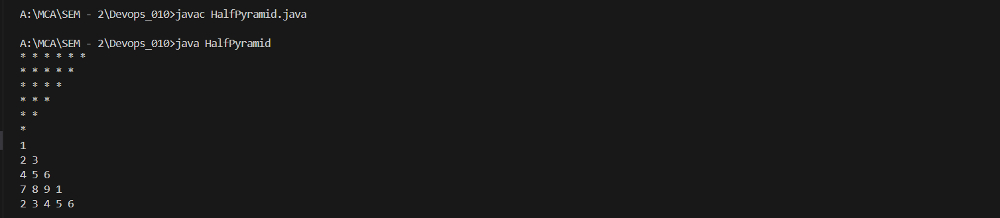
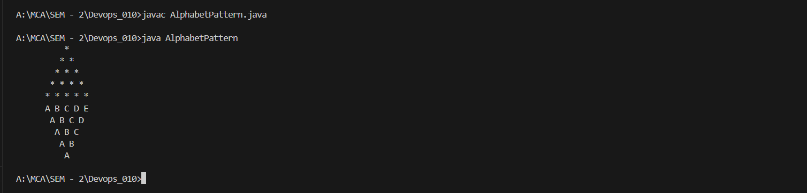
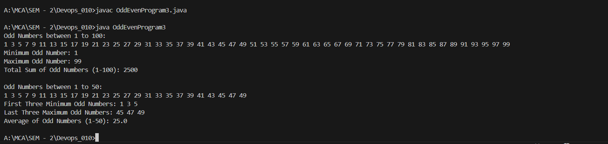

# Practical 3 – Java Programs

## Half Pyramid Output

## Alphabet Pattern Output

## Odd Even Numbers Output

# Cloud Computing with DevOps Practical

## Student Information

| Name | Enrollment Number | Practical Set |
|------|-------------------|---------------|
| Aqsa Gandevia| 202504104610010 | Set A |
| Vivek Gosai  | 202504104610023 | Set B |
 

---

## Logos

### University

### Department

---

## Subject

Cloud Computing with DevOps

---

## Practical Overview

This repository contains practical exercises related to Cloud Computing with DevOps.

It includes:

- Java Programs
- GitHub Commands
- Documentation

---

## Notes

- Each practical is in separate file
- requirements.txt contains dependencies
- Screenshots included

